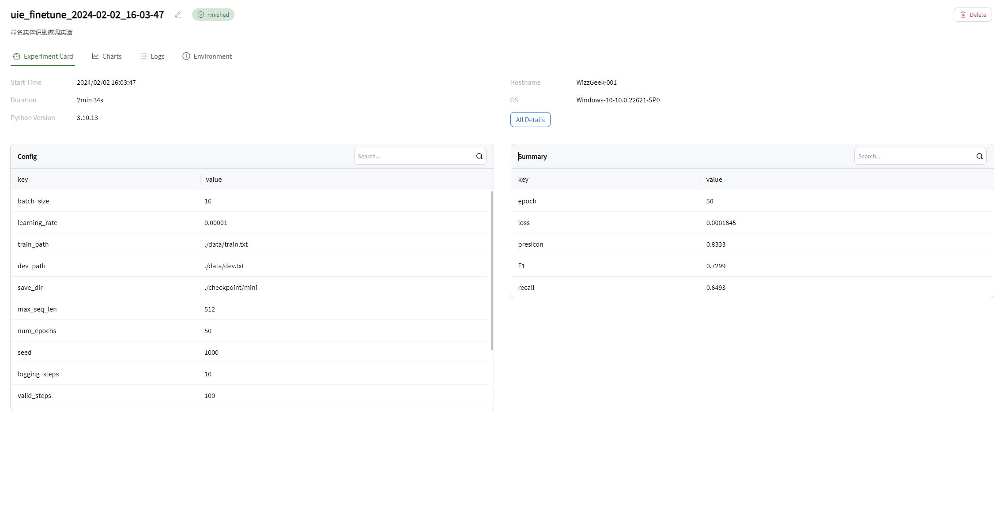

# UIE

This example is case about how to use personal data to finetune UIE model and monitor training process through swanlab.

The model file should be downloaded from [swanhub/uie](https://swanhub.co/KashiwaByte/UIE-Finetune) or huggingface and moved to **uie_mini_pytorch** folder

The  data file is in folder **data**. You can also get your own data through follow github library [uie-pytorch]( https://github.com/HUSTAI/uie_pytorch).

## Train

    # make sure your python version >=3.10
    pip install -r requirements.txt
    python main.py

## Monitor

    swanlab watch -l logs --host 0.0.0.0

## Evaluate

    python evaluate.py --debug

